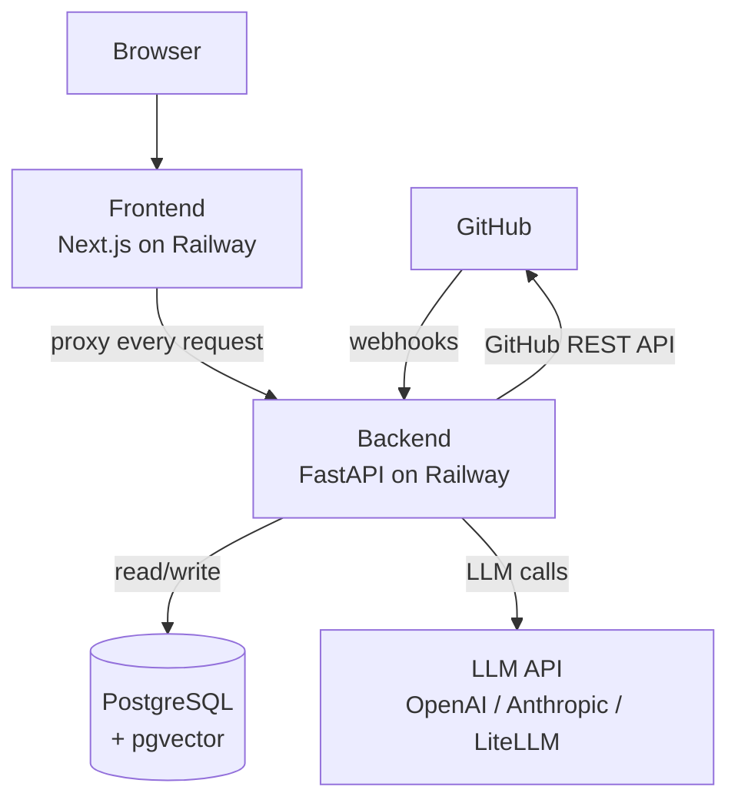
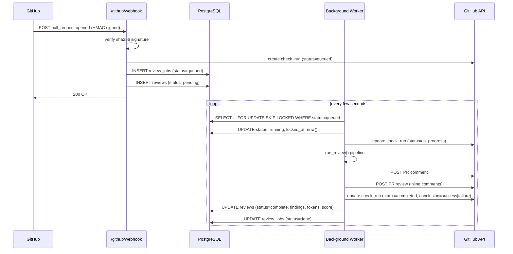
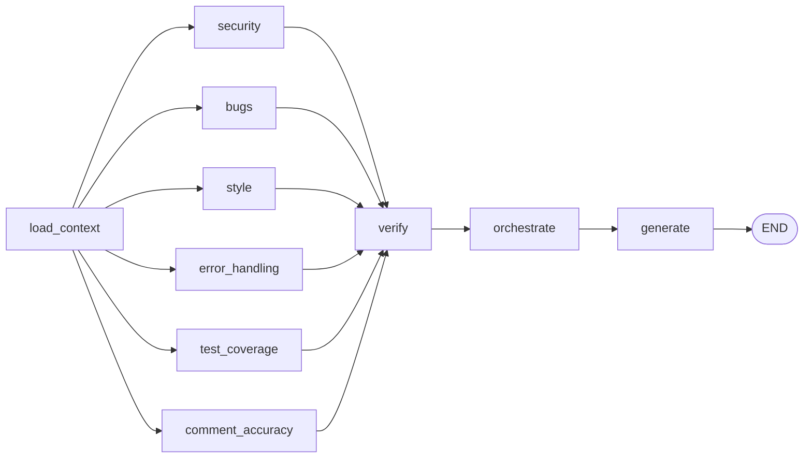
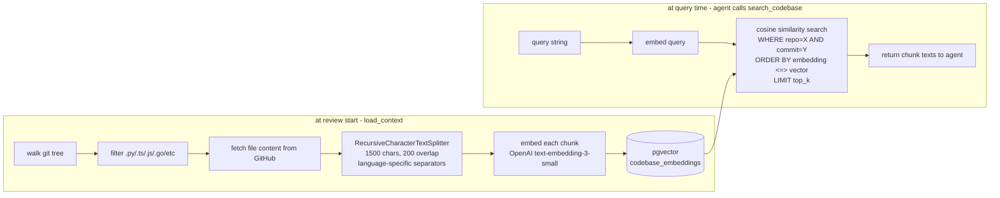
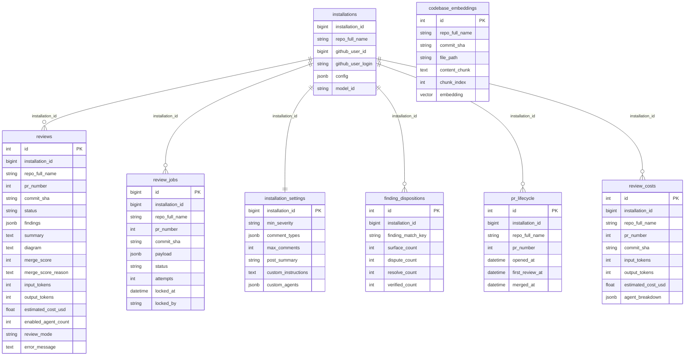

# CodeSentinel — Architecture

---

## High-Level System Map



---

## 1. Frontend

**Stack:** Next.js (App Router), TailwindCSS, shadcn/ui  
**Deployed:** Railway, same monorepo as backend

### Key files

| File | What it does |
|---|---|
| `src/app/api/backend/[...path]/route.ts` | Catch-all proxy. Every `GET/POST/PUT/DELETE` from the UI hits `/api/backend/*` which this route forwards verbatim to `BACKEND_URL`. No frontend logic touches the DB directly. |
| `src/lib/api.ts` | Typed API client. Every page uses `api.listReviews()`, `api.listInstallations()` etc. All calls go through the proxy above. |
| `src/app/dashboard/reviews/page.tsx` | Reviews table: Score, Repo, PR, Findings, Tokens column, Status, Date. |
| `src/app/dashboard/reviews/[id]/page.tsx` | Review detail: findings list, summary, diagram, token count, cost. |
| `src/app/dashboard/repositories/page.tsx` | Lists repos the GitHub App has access to. |
| `src/app/dashboard/analytics/` | FP rate charts, disposition history per installation. |
| `src/lib/utils.ts` | `formatDate` (IST timezone via `NEXT_PUBLIC_TIMEZONE`), `scoreColor`, `severityColor`. |

### Auth flow in the browser

1. User clicks "Install App" → redirected to GitHub App install page.
2. After install, GitHub redirects back with `?code=` → backend `/auth/github/callback` exchanges it for OAuth token, stores in HTTP-only session cookie.
3. Every API request sends the cookie → backend reads `github_user_id` from session → scopes all DB queries to that user.

---

## 2. Backend

**Stack:** FastAPI, async SQLAlchemy (asyncpg), Alembic, structlog  
**Deployed:** Railway

### API Routers

| Router | Prefix | Responsibilities |
|---|---|---|
| `webhook.py` | `/github/webhook` | Receives GitHub events, verifies HMAC-SHA256 signature, routes to handlers |
| `installations.py` | `/api/installations` | List installations per user (with live GitHub API sync), list repos per installation, CRUD settings |
| `reviews.py` | `/api/reviews` | List/get reviews scoped to authenticated user's installations |
| `analytics.py` | `/api/analytics` | Aggregate FP insights, finding dispositions per installation |
| `auth.py` | `/auth` | GitHub OAuth callback, session management |

### Request Scoping

Every endpoint reads `github_user_id` from the session cookie via `get_github_user_id` dep.  
Queries always filter through `Installation.github_user_id == github_user_id` — no user ever sees another user's data.

---

## 3. Webhook → Queue → Worker

This is the core event-driven path that triggers a review.



### Webhook Events Handled

| Event | Action | What happens |
|---|---|---|
| `pull_request` | opened / synchronize / reopened / ready_for_review | Creates check run (queued), enqueues `ReviewJob` |
| `pull_request` | closed | No review, ignored |
| `check_run` | rerequested | Re-enqueues the job (this is the "Re-run" button on GitHub) |
| `installation` | created | Adds `Installation` rows for each accessible repo |
| `installation` | deleted | Removes all `Installation` rows for that installation_id |
| `installation_repositories` | added | Adds new `Installation` rows |
| `installation_repositories` | removed | Deletes `Installation` rows |
| `issue_comment` | created | Bot command handling (e.g. re-trigger) |
| `pull_request_review_comment` | created | Inline feedback processing |

### Queue mechanics

- **Table:** `review_jobs` in PostgreSQL (no Redis, no Celery).
- **Lock:** `SELECT ... FOR UPDATE SKIP LOCKED` so multiple workers don't pick the same job.
- **Retry:** `attempts` counter + `next_attempt_at` backoff.
- **Worker:** runs as an `asyncio` background task inside the FastAPI process (started in `main.py` lifespan).

---

## 4. LangGraph Review Pipeline



### Node-by-node breakdown

#### `load_context`
- Fetches PR diff from GitHub API (capped at `max_context_kb` bytes).
- Fetches full PR metadata (title, body, labels, base/head).
- Reads `.conventions.md` from root of repo if it exists.
- Reads `.codesentinel.yml` for per-repo config overrides.
- Calls `index_codebase()` — indexes the repo into pgvector for RAG (skips if already indexed for this commit SHA).
- Outputs: `diff`, `pr_context`, `conventions`, `config`, initialises `tokens_used = {input:0, output:0}`.

#### `security`, `bugs`, `style`, `error_handling`, `test_coverage`, `comment_accuracy` (parallel)
All 6 run **concurrently** as separate `asyncio` tasks within LangGraph.  
Each is a **ReAct agent** (`create_react_agent`):
- Gets a specialist prompt (security focuses on injection/auth/secrets, bugs on logic/null/race, etc.)
- Has access to tools (see section 5)
- Runs a tool-call loop: LLM decides which tool to call, gets result, calls another tool or finishes
- Final message must be a JSON array of findings: `[{file, line, severity, confidence, title, description, suggestion, category}]`
- Returns `raw_findings` (appended via `operator.add` reducer) + per-node `tokens_used`

#### `verify`
- Runs **sequentially** after all 6 agents finish.
- For every finding with severity `critical` or `warning`:
  - Fetches the actual file content from GitHub (up to 10,000 chars).
  - Sends to a **separate verifier LLM** (configurable, defaults to a different model than agents) with `VERIFIER_PROMPT`.
  - Verifier returns `{valid: bool, confidence: float, reason: str}`.
  - Tags finding with `verification = "verified"` or `"unverified"`.
- `info` findings skip verification.
- This is the cross-model check to reduce false positives.

#### `orchestrate`
- Filters findings below `min_confidence` threshold.
- Deduplicates by `(file, line, title[:50])` key.
- Sorts by severity then confidence descending.
- Caps at `max_findings`.
- Calls the LLM with `ORCHESTRATOR_PROMPT` to assign a **merge score 1-5** and reason.
- Score clamping: if all criticals are unverified → score floored to 3 (won't block merge on unverified findings).
- Fallback if LLM fails: score = `max(1, 5 - critical_count)`.

#### `generate`
- Runs **3 LLM calls in parallel** via `asyncio.gather`:
  1. `SUMMARY_PROMPT` → 2-3 sentence PR summary.
  2. `DIAGRAM_PROMPT` → Mermaid `flowchart` showing architecture impact.
  3. `DELTA_CAPTION_PROMPT` → "compared to previous review: 3 new issues, 2 resolved" (only if previous findings exist in DB).

### State (`ReviewState`)

All nodes communicate via a shared `TypedDict`. Reducers handle concurrent writes:

| Field | Type | Reducer | Notes |
|---|---|---|---|
| `raw_findings` | `list[Finding]` | `operator.add` | 6 agents append concurrently |
| `tokens_used` | `dict` | `_merge_tokens` | sums `input`+`output` across all nodes |
| `enabled_agent_count` | `int` | `operator.add` | each agent adds 1 |
| `errors` | `list[str]` | `operator.add` | error strings accumulate |
| everything else | various | last-write-wins | sequential nodes |

### Token tracking

Every node extracts token usage from `response_metadata` on each AI message:
- OpenAI: `token_usage.prompt_tokens` / `completion_tokens`
- Anthropic: `usage.input_tokens` / `output_tokens`

Accumulated into `tokens_used` and stored in `reviews.input_tokens` / `reviews.output_tokens`.  
Also shown in the GitHub check run summary and PR comment footer.

---

## 5. Agent Tools

Each agent gets the same tool set, scoped to the current `(owner, repo, commit_sha)`:

| Tool | What it does |
|---|---|
| `read_file(path)` | Fetches raw file content from GitHub API for the PR's head commit |
| `grep_codebase(pattern, file_filter?)` | Calls GitHub's code search API for the repo, returns matching file paths |
| `search_codebase(query, top_k=5)` | Embeds `query` via OpenAI → cosine similarity search on `codebase_embeddings` → returns top-k chunk texts with similarity scores |
| `analyze_ast(path)` | Fetches `.py` file, parses with Python `ast` module, returns functions/classes/methods with line numbers |
| `trace_data_flow(variable, file_path)` | Reads file, finds all lines where `variable` appears — helps agents track how data moves |

Agents decide themselves when and which tools to call (ReAct loop). A security agent spotting `exec(` will typically call `read_file` to see full context, then maybe `trace_data_flow` to see where the input came from.

---

## 6. RAG System



### Chunking strategy

`RecursiveCharacterTextSplitter.from_language(language)` tries separators in priority order:
- **Python:** `\nclass ` → `\ndef ` → `\n\n` → `\n` → character
- **TypeScript/JS:** `\nfunction ` → `\nconst ` → `\nclass ` → `\ninterface ` → ...
- **Go:** `\nfunc ` → `\ntype ` → `\nvar ` → ...
- **Rust:** `\nimpl ` → `\nfn ` → `\npub fn` → ...

Chunk size: **1500 chars** (~375 tokens). Overlap: **200 chars** so functions split across boundaries still have context.

### When indexing is skipped

```python
SELECT count(*) FROM codebase_embeddings
WHERE repo_full_name = :repo AND commit_sha = :ref
```
If > 0 rows exist → skip. Each unique `(repo, commit_sha)` is indexed once and reused for all parallel agents in that review.

---

## 7. Database Schema



---

## 8. GitHub Auth

Two separate auth mechanisms used in parallel:

### App-level (JWT)
- `GitHubAuthProvider.get_app_token()` signs a JWT with the App's RSA private key, valid 10 min.
- Used to call `/app/installations` and create installation access tokens.

### Installation-level (short-lived token)
- `GitHubAuthProvider.get_installation_token(installation_id)` calls `POST /app/installations/{id}/access_tokens` using the JWT above.
- Returns a token valid ~1 hour. Cached in memory.
- Used for all repo-level calls: fetch diff, post comment, create check run, fetch file contents.

### User-level (OAuth)
- User installs the app → GitHub redirects with `?code=` → backend exchanges for OAuth token.
- Stored in session cookie (HTTP-only, server-side).
- Used to call `/user/installations` to find which installations belong to the user.
- Also used by `_auto_claim_installations` to stamp `github_user_id` on `Installation` rows.

---

## 9. Installation Sync (Dynamic Repo List)

The `GET /api/installations` endpoint does more than just read the DB:

```
1. _auto_claim_installations(db, github_user_id, oauth_token)
   → calls GET /user/installations with user's OAuth token
   → for each returned installation: UPDATE installations SET github_user_id=X WHERE github_user_id IS NULL

2. Query DB for all known installation_ids for this user

3. _sync_installation_repos(db, installation_id, github_user_id) for each
   → get installation token for this install_id
   → call GET /installation/repositories (authoritative list from GitHub)
   → compare with DB rows for this install_id
   → INSERT new repos not in DB
   → DELETE rows whose repos were revoked by user

4. Return fresh installation list from DB
```

This means the repo list is **always accurate** even if webhooks were missed or user changed access scopes since install.

---

## 10. GitHub Output (What Users See)

After a review completes, three things are posted to GitHub:

### Check Run
- Created as `queued` when PR is opened.
- Updated to `in_progress` with live step labels as each agent finishes:  
  `✅ Security scan  ✅ Bug detection  ⏳ Style check...`
- Completed with:
  - `title`: `3/5 — 2 critical, 3 warnings`
  - `summary`: merge reason + token footer:  
    `🔢 Tokens: 45,231 (↑ 38,100 input / ↓ 7,131 output) · 💰 Est. cost: $0.0023`
- On failure: `❌ Review failed — click Re-run to retry` + partial token count.

### PR Comment (bot posts / updates)
Markdown comment with:
- Score emoji + `X/5`
- Merge reason in italics
- Delta caption (vs previous review)
- Summary paragraph
- Findings table (severity, file, line, confidence, verified status)
- Detailed finding cards (description + suggestion for each)
- Mermaid architecture impact diagram
- Footer: `🔢 X tokens (↑ in / ↓ out) · 💰 $cost`

### Inline PR Review Comments
- Only for `critical` and `warning` findings.
- Uses GitHub's Review API (`POST /repos/.../pulls/.../reviews`).
- Each finding becomes an inline comment on the specific file+line.
- If score ≤ 2 → `REQUEST_CHANGES`, score ≥ 4 → `APPROVE`, otherwise `COMMENT`.

---

## 11. LLM Provider Configuration

| Setting | Env var | Purpose |
|---|---|---|
| Provider | `LLM_PROVIDER` | `openai` / `anthropic` / `litellm` |
| Model | `LLM_MODEL` | e.g. `gpt-4o`, `claude-3-5-sonnet-20241022` |
| Verifier provider | `VERIFIER_PROVIDER` | Different provider/model for cross-verification |
| Verifier model | `VERIFIER_MODEL` | Intentionally different from agent model |
| Reasoning effort | `REASONING_EFFORT` | For o1/o3/o4-mini: `low`/`medium`/`high` |
| Embedding model | `EMBEDDING_MODEL` | For RAG indexing (OpenAI only) |
| Max tokens/agent | `MAX_TOKENS_PER_AGENT` | Per-agent LLM output cap |
| Max context KB | `MAX_CONTEXT_KB` | Diff truncation limit |

Reasoning models (`o1`, `o3`, `o4-mini`, `gpt-5.*`) automatically use `reasoning_effort=none` when tool-calling (tools + reasoning effort > 0 cause a 400 from OpenAI).
